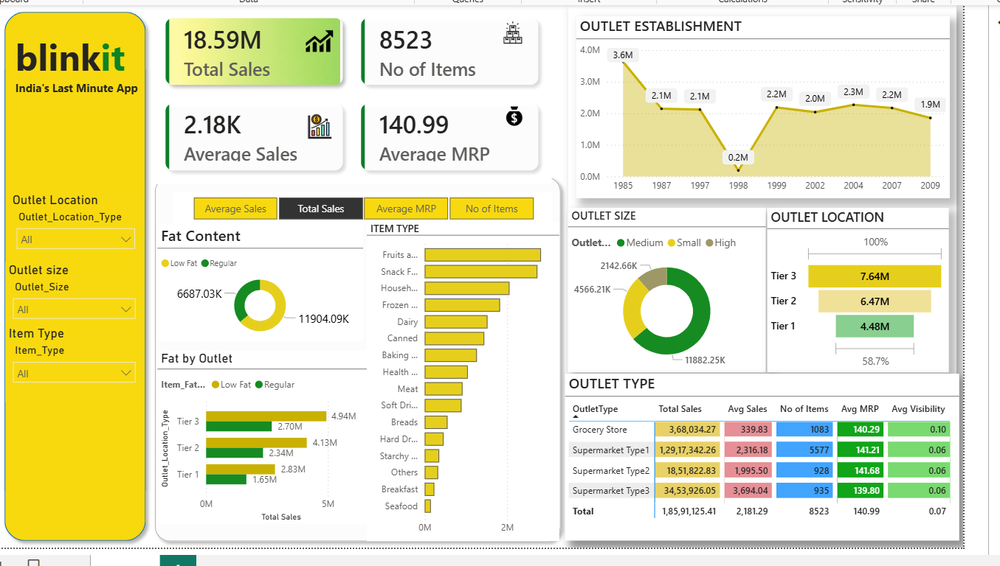

# Blinkit Sales Analysis Dashboard using Power BI

## Project Overview

This project is an interactive Power BI dashboard built to analyze Blinkit grocery sales data. The dashboard provides business insights into sales performance, item categories, outlet types, outlet sizes, outlet locations, and customer product preferences.

The goal of this project is to understand how different outlet and product features impact total sales and overall business performance.

---

## Dashboard Preview



---

## Tools Used

- Power BI Desktop
- Power Query
- DAX
- Microsoft Excel / CSV Dataset
- Data Visualization

---

## Dataset

The dataset contains Blinkit grocery sales information with fields such as:

- Item Fat Content
- Item Type
- Item MRP
- Item Visibility
- Item Outlet Sales
- Outlet Establishment Year
- Outlet Size
- Outlet Location Type
- Outlet Type

---

## Key Performance Indicators

The dashboard includes the following KPI cards:

- Total Sales
- Average Sales
- Number of Items
- Average MRP
- Average Visibility

---

## Dashboard Features

- Interactive slicers for filtering data
- KPI cards for quick business summary
- Donut chart for fat content analysis
- Bar chart for item type sales performance
- Area chart for outlet establishment trend
- Funnel chart for outlet location analysis
- Donut chart for outlet size contribution
- Matrix table for outlet type performance
- Conditional formatting for better visual understanding

---

## Key Insights

- Total sales reached approximately 18.59M.
- Supermarket Type 1 generated the highest sales and item count.
- Tier 3 outlet locations contributed the highest sales.
- Fruits and Vegetables and Snack Foods were among the top-performing item categories.
- Medium-sized outlets contributed a major share of sales.
- Low Fat items generated higher sales compared to Regular items.

---

## DAX Measures Used

```DAX
Total Sales = SUM('Blinkit Data'[Item_Outlet_Sales])

Average Sales = AVERAGE('Blinkit Data'[Item_Outlet_Sales])

No of Items = COUNTROWS('Blinkit Data')

Average MRP = AVERAGE('Blinkit Data'[Item_MRP])

Average Visibility = AVERAGE('Blinkit Data'[Item_Visibility])
